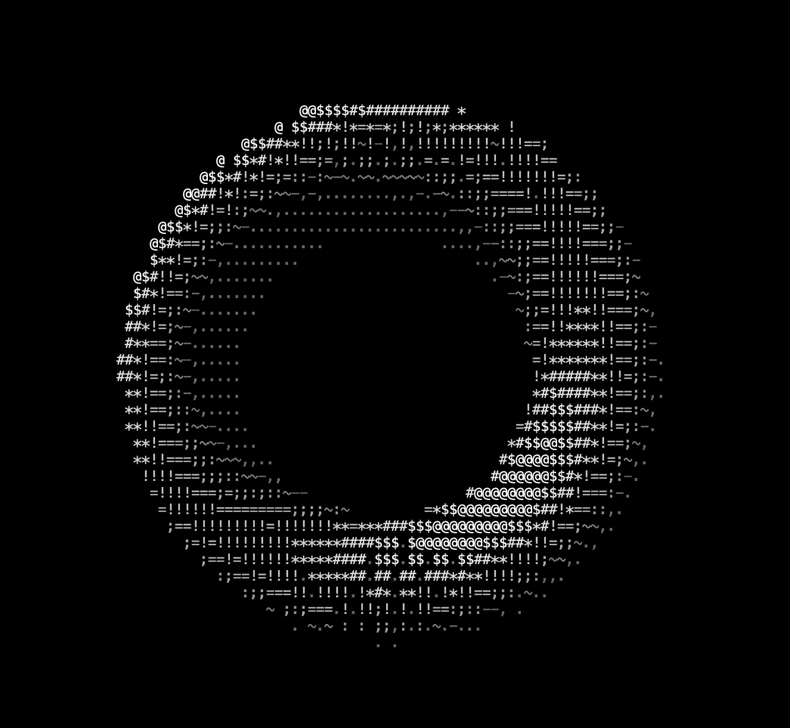

# Donut

A spinning ASCII donut that runs on the terminal, implemented in C++

## Requirements

* [CMake 3.20+](https://cmake.org/)

# Getting Started

### Command line arguments

* `-w=` to the width of the viewport; 0 sets it to terminal width (e.g. -w=80)
* `-h=` to the height of the viewport; it is recommended to set height to be half of the width; 0 sets it to terminal height (e.g. -h=40)
* `-fps=` to the target FPS of the application; 0 sets removes FPS cap (e.g. -fps=60)
* `-shd=` (y/n) to enable/disable complex shading (e.g. -shd=n)

## Building

1. Clone the repository using `git clone --recursive https://github.com/VergilSparda114514/donut.git`
2. Run `cmake` to generate Makefiles
3. Run `make` to build the project

### 3rd party libraries

* [FTXUI](https://github.com/ArthurSonzogni/FTXUI)
* [glm](https://github.com/g-truc/glm)

